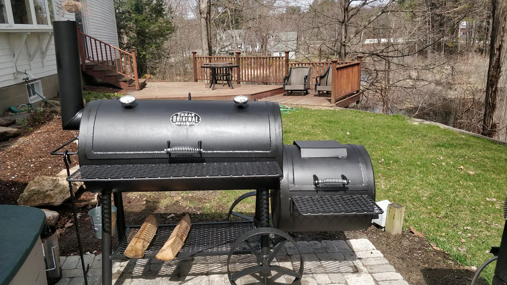

# About

At New England Smokery, we believe that smoke is more than just a technique—it's an art form. We're passionate about
transforming everyday ingredients into extraordinary culinary experiences through the time-honored tradition of slow
smoking.

## Our Story

We started New England Smokery because we wanted to share the rich, complex flavors that only slow smoking can achieve.
We were frustrated with the lack of quality smoked goods available, so we decided to create our own.

## Our Philosophy

We're committed to using only the finest ingredients and time-honored techniques. We meticulously select premium
cheeses and nuts, locally sourced vegetables and smoke them low and slow over hickory, applewood, and mesquite. This
patient process allows the smoke to penetrate deeply, infusing each ingredient with a depth of flavor that's simply
unmatched.

## Our Products

We offer a curated selection of smoked goods, including:

* Smoked Cheeses
* Smoked Nuts and Vegetables

## Our Commitment to Quality

We believe that quality is paramount. That's why we hand-select each ingredient, monitor our smoking process
meticulously, and use sustainable practices. We're dedicated to bringing you smoked goods that are not only delicious
but also crafted with integrity.

## Our Promise

When you choose New England Smokery, you're choosing more than just food. You're choosing a taste of tradition, a
commitment to quality, and a passion for flavor. We're confident that you'll taste the difference in every bite.

